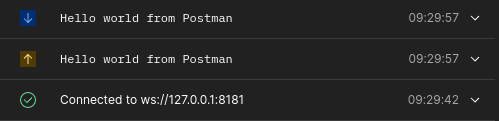
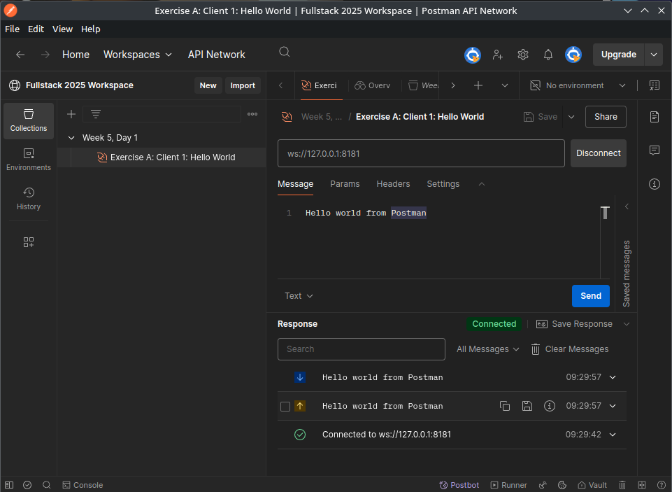
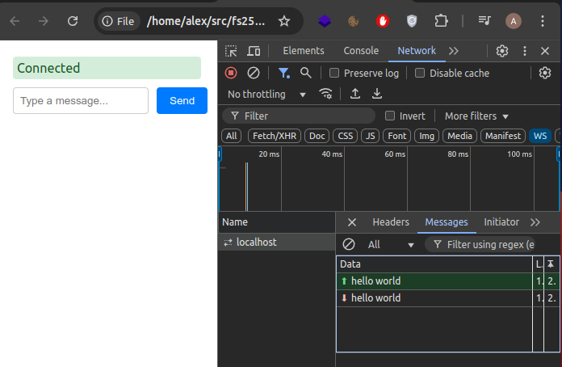
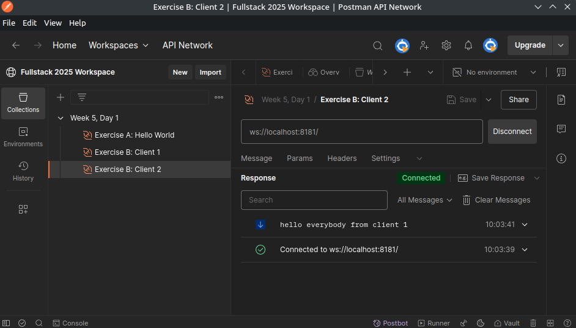

# 💥WELCOME TO FULLSTACK 2025💥

[](https://www.youtube.com/watch?v=G5b1Zd367sA)

Click above image to go to today's vid ☝️

### Today's Agenda

- 08:15: Intro to WebSockets
- 08:45: Exercise A: First WebSocket API
- 09:30: Exercise A (& maybe B) walkthrough in class
- 10:00: Exercise B + C

[//]: # (github repo link uldahlalex/fs25_5_1)
Today's remote repo is located: https://github.com/uldahlalex/fs25_5_1 (Includes solutions for the exercises)*

### Tooday's topics:

- WebSockets (protocol, client-server communication)
- Fleck .NET library
- WebSocket clients (React, built-in browser client, Postman Desktop client)

### Exercises


<!-- #region ex A -->


<div>
<details>
    <summary>Exercise A: First WebSocket API (Stateless with "echo")</summary>

<div style="margin: 20px; padding: 5px; box-shadow: 10px 10px 10px black;">

#### Difficulty: ★☆☆☆☆

#### Task

Create a .NET WebSocket API with Fleck.
We aim to make the most basic WS server: "Stateless" (API doesn't retain data) and only "echos" client messages (gives
back what it receives).



#### Instructions

Install "Fleck" as Nuget to a .NET Web project.

You may follow the "Example" from the README.md here:
<https://github.com/statianzo/Fleck>

*Tip: Add some logic to "stall" the application after starting the server. Otherwise, it will just stop once the end of
file is reached. You may use this snippet:*

```csharp
Console.ReadLine();
```

**How to test it works**

We need a client to use the WS API now. Use **both** ways described below to test your API (manual testing).

**First way: Use Postman Desktop's WebSocket Client:**

You can Download Postman Desktop client here (the browser version doesn't have WebSocket capability):

*Tip: You can download my Fullstack2025 Postman Workspace. You can find prepared Websocket connections + messages in "
fs_5_1"*

Upon success, you should be able to connect a client and get an echo response from the API upon sending a message:



**Second way: Simple browser app using a single HTML file with JS** (observational exercise)

Open this file: <https://github.com/uldahlalex/fs25_5_1/blob/master/ExerciseASolution/client-app.html>
with your web browser.
Now go to the network tab and inspect "WS" traffic. You should be able to see messages going both ways when chatting
with the API.



</div>


</details>
</div>


<!-- #endregion -->

______


<!-- #region ex B -->


<details>
    <summary>
    Exercise B: WebSocket API with State + Broadcasting</summary>

<div style="margin: 20px; padding: 5px;  box-shadow: 10px 10px 10px grey;">

#### Difficulty: ★⯪☆☆☆

#### Task

When connecting to the API, it should now store the IWebSocketConnection in memory.
When a connection sends a message, loop through all connections and send the messaage to each connection.

#### Testing it

Connect 2 clients (or more) to the same sever and let one client broadcast to others:



</div>
</details>


<!-- #endregion B -->

__________

<!-- #region ex C -->

<details>
    <summary>Exercise C: A Proper Client App For The API</summary>

<div style="margin: 20px; padding: 5px;  box-shadow: 10px 10px 10px grey;">


#### Task

Make a small React+Typescript+Vite application where you use the react-use-websocket npm package to facilitate connection with the C# WebSocket API: https://www.npmjs.com/package/react-use-websocket

**There is no singluar end-goal to this exercise: It is just about becoming familiar with the technologies and making observations. Be creative with this one** 

</div>
</details>

<!-- #endregion ex C -->
_________


### Exam Dialogue Examples For Today's Topics
- Explain some differences between using HTTP REST and WebSockets
- Explain some differences between as stateful and a stateless server application

### Additional literature & references
- Postman WebSocket Docs: https://learning.postman.com/docs/sending-requests/websocket/websocket-overview/
